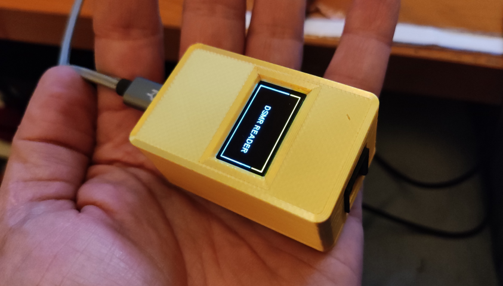

# DSMR Reader for ESPHome

A smartmeter integration project, based on the ESP8266 D1 Mini board, made for ESPHome (hardware + ESPHome config).
This device can be used with the energy dashboard that was introduced in Home Assistant 2021.8.0.

The goal of the project is to provide an open source design for an easy to build ESPHome DSMR reader device.

# Files

* [Schematic](PCB/schematic.png)
* [PCB design](PCB/design.png)
* [Gerber file](PCB/schematic.zip) (can be used for ordering the PCB at for example JLCPCB)
* [ESPHome example configuration](example.yaml)

# Compatibility

The device can be directly powered by the smart meter. This has been tested with DSMR v4 and DSMR v5 meters.

I have a **DSMR v4.2** meter myself, which delivers enough current to power the ESP8266 D1 Mini.
It does require a 1000 uF capacitor though, to handle the power peaks of the D1 Mini during startup and
connecting to the WiFi network.

There are also DSMR v4 meters that don't deliver enough current to run the device. For those meters and
for earlier DSMR versions, it is possible to power the D1 Mini using an external power supply.

Please let me know if you find additional compatibility outcomes.

# Parts list

* 1 x DSMR Reader PCB (can be ordered from a manufacturer like JLCPCB using the Geber file)
* 3 x Resistor 1 kOhm
* 1 x Resistor 200 Ohm
* 1 x Resistor 100 Ohm
* 1 x Transistor 2N2222 TO92
* 1 x Optocoupler 4N35
* 1 x Capacitor 1000 uF
* 1 x RJ12 socket
* 1 x ESP8266, D1 Mini (with male headers)
* 2 x 8 pin female header (for connecting the D1 mini)
* 2 x 2 pin male header
* 2 x header jumper (fits over the 2 pin male header)
* 1 x RJ12 to RJ12 cable (straight)

**Optionally, for connecting an OLED display**

* 1 x 4 pin female shield stacking header
* 2 x 4 pin male header (of which only the plastic part is used)
* 1 x SSD1306 128x64 I2C OLED display

# Credits

The circuit that I used as a starting point for my board:
https://klushok.etv.tudelft.nl/projects/view?id=8

This one got some nice ideas too:
https://willem.aandewiel.nl/index.php/2019/04/09/dsmr-logger-v4-slimme-meter-uitlezer/

This page had a good collection of info about the P1 port:
http://domoticx.com/p1-poort-slimme-meter-hardware/

Some nice folks that helped me improving the design:
- from the ESPHome discord channel, in alphabetical order:
  Azimath, Frank Bakker, Jos, stoic
- Zoltán Komló
